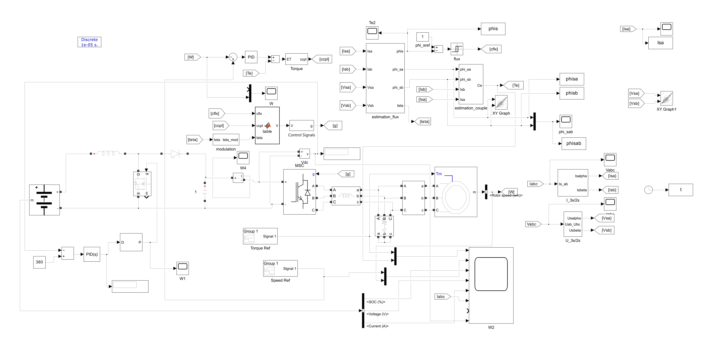
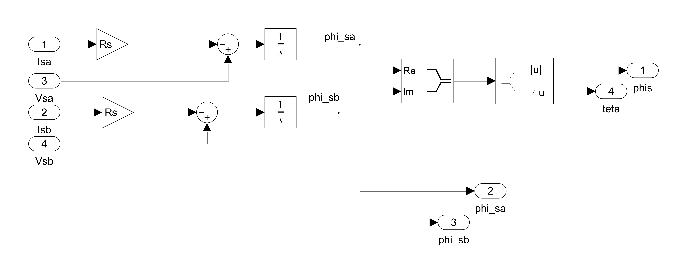
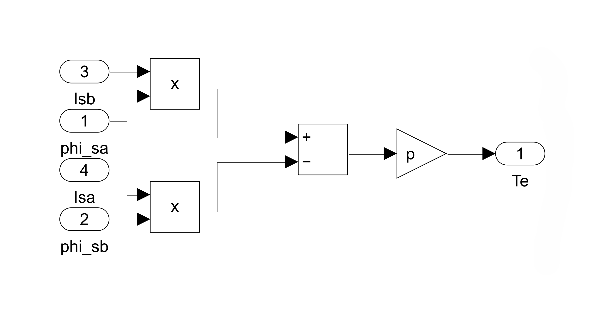

# Direct Torque Control (DTC) of an Induction Motor in MATLAB/Simulink

This repository contains the documentation and simulation results for a Direct Torque Control (DTC) system for a three-phase induction motor, implemented in MATLAB/Simulink. The goal of this project is to demonstrate a high-performance motor control strategy without using the actual Simulink model file.

---

## Project Overview

Direct Torque Control (DTC) is a sophisticated vector control technique used for the precise control of AC induction motors. Unlike other vector control methods, DTC does not require pulse-width modulation (PWM) or current regulators. Instead, it directly controls the motor's stator flux and electromagnetic torque by selecting the optimal inverter voltage vector.

### Key Features of DTC:
-   **Excellent Dynamic Response**: Torque and flux can be changed very rapidly.
-   **Simple Structure**: No need for complex coordinate transformations (like Park's transformation) in the main control loop.
-   **Robustness**: Less sensitive to motor parameter variations.

---

## Simulink Model Architecture

The control system was designed and simulated in Simulink. The model consists of several key subsystems that work together to achieve precise torque control.

The main components are:
1.  **Induction Motor Model**: A standard three-phase asynchronous machine block representing the motor.
2.  **Three-Phase Inverter**: A universal bridge block that supplies voltage to the motor based on switching signals.
3.  **DTC Controller**: This is the core of the system and contains the following parts:

a. **Flux and Torque Estimator**: Calculates the stator flux magnitude, flux angle (sector), and electromagnetic torque based on the motor's stator voltages and currents.
   

b. **Torque Estimator**: Calculates the stator flux magnitude, flux angle (sector), and electromagnetic torque based on the motor's stator voltages and currents.

*
c. **Hysteresis Comparators**: Two-level comparators for torque and three-level comparators for flux that compare the estimated values with the reference commands.
d. **Optimal Switching Table**: Selects the appropriate inverter voltage vector based on the outputs from the hysteresis comparators and the current flux sector.

### Optimal Switching Table Logic

The core of the control strategy is the optimal switching table, which is implemented in an **Embedded MATLAB Function** block. This code determines which voltage vector the inverter should apply based on the digitized errors from the torque and flux hysteresis controllers, as well as the current stator flux sector.

The complete implementation is shown in the embedded GitHub Gist below:

---

## Simulation Results

The simulation was run to evaluate the performance of the DTC controller under various operating conditions. The following plots demonstrate the system's effectiveness.

*(**Action for you**: Run your simulation and take screenshots of the key output graphs from your scopes. Name them appropriately (e.g., `torque_response.png`, `speed_response.png`) and place them in the `images` folder.)*

### 1. Torque Response

This graph shows the electromagnetic torque of the motor (blue) tracking the reference torque command (yellow). The controller maintains the torque within the specified hysteresis band, resulting in a very fast dynamic response.

*Figure 2: Electromagnetic Torque vs. Reference Torque.*

### 2. Speed Response

This plot shows the motor's rotor speed tracking the reference speed command. The system effectively controls the motor's speed by managing its torque.

*Figure 3: Rotor Speed vs. Reference Speed.*

### 3. Stator Flux Trajectory

The trajectory of the stator flux vector is shown below. An ideal DTC system maintains the flux magnitude constant, resulting in a nearly perfect circular path. This indicates excellent flux control.

*Figure 4: Stator Flux Linkage (d-q plot).*

### 4. Stator Currents

This graph displays the three-phase stator currents ($I_a, I_b, I_c$). The sinusoidal nature of the currents indicates smooth operation of the induction motor.

*Figure 5: Three-Phase Stator Currents.*

---

## How to Replicate This Project

Since the `.slx` file is not provided, you can replicate this project by following these steps:

1.  **Software**: Ensure you have **MATLAB** and **Simulink** installed.
2.  **Build the Model**: Construct the Simulink model as shown in the block diagram (Figure 1). Use standard blocks from the Simscape Electrical library.
3.  **Set Parameters**: Configure the blocks with the appropriate parameters for the induction motor, inverter, and controller (e.g., motor ratings, hysteresis band values, reference torque/speed).
4.  **Run Simulation**: Run the simulation and use scopes to observe the outputs. You should be able to generate results similar to those shown above.

---

## License

This project is licensed under the MIT License. See the `LICENSE` file for details.
